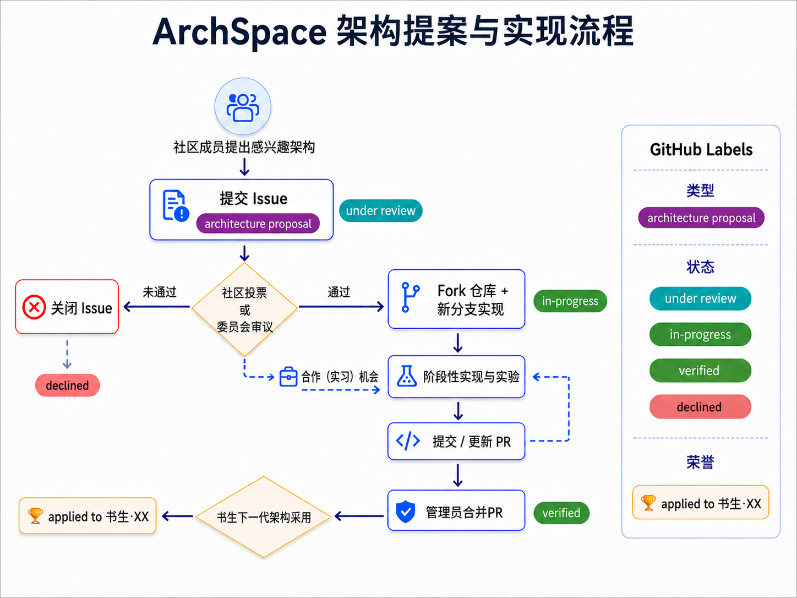

<h1 align="center">ArchSpace</h1>

    
    
    

<h4 align="center">
    

        <a href="REAME.md">English</a> |
        <a href="REAME_CN.md">简体中文</a>
    

</h4>
<h3 align="center">
    
让每一次架构探索，都成为行业可复用的知识

</h3>

ArchSpace 是一个面向大语言模型（LLM）架构创新的开放实验。我们希望将社区提出的架构假设，置于公开、可追溯、可复现的训练与评测流程中验证，并将成功经验、负面结果与架构取舍沉淀为可共享的知识资产。

每一代开源基模都会带来新的架构设计，但这些设计在完整训练流程中的真实收益、适用边界与失败经验，往往难以被行业充分复用。ArchSpace 希望为这一问题提供一个公共实验场：从 GitHub 上的一条 proposal issue 开始，到同行评审、实现、训练、评测和结论发布，形成完整的开放协作闭环。

## 我们在做什么

- **开放提案**：社区成员可提交值得验证的架构创新提案。
- **同行评议**：评委会从创新价值、技术可行性和实验设计完备性等方面审阅提案。
- **完整验证**：通过审阅的提案将进入统一训练与评测流程，覆盖预训练、指令微调和强化学习。
- **公开记录**：训练和评测日志将在 Weights & Biases（W&B）等平台持续记录并公开。
- **沉淀知识**：无论结果为正向、负向还是有条件成立，相关实现、实验记录与结论都将向社区开放。

## 贡献方式

请在 [Issues](../../issues/new/choose) 中选择 `architecture proposal` 模板，并尽量完整填写以下内容：

## 验证流程

通过审阅的提案将按照与全开源基模 [Olmo 3](https://arxiv.org/abs/2512.13961) 对齐的完整训练流程进行验证：

- **模型规模**：1B、3B、8B；
- **训练阶段**：预训练、指令微调、强化学习；
- **训练规模**：完整流程合计约 6T tokens；
- **过程记录**：训练与评测日志将记录在 W&B 并公开；
- **结果发布**：发布实现、配置、指标、实验记录和结论，尽可能说明架构取舍与适用条件。

我们尤其重视负面结果。一项没有获得预期收益的架构尝试，只要经过清晰、充分的验证，同样能够帮助社区避免重复试错。

## 贡献方式

你可以通过以下方式参与 ArchSpace：

1. 在 Issues 中提交或讨论架构创新提案。
2. 为已通过的提案贡献实现、测试、评测或文档。
3. 通过 Pull Request 提交阶段性实现和实验更新。
4. 帮助复现、审阅和解读公开实验结果。
5. 分享与提案相关的论文、代码、数据或工程经验。

提交 Pull Request 前，请说明它关联的 issue、改动范围、运行方式和当前实验结果。请不要在未经讨论的情况下提交大规模、难以审阅的重构。

## 参考资料

- [Next Concept Prediction in Discrete Latent Space Leads to Stronger Language Models](https://arxiv.org/abs/2602.08984)
- [Olmo 3](https://arxiv.org/abs/2512.13961)
- [习近平在 2026 世界人工智能大会暨人工智能全球治理高级别会议开幕式上的主旨讲话](https://www.news.cn/politics/leaders/20260717/72728b6f94154d63b3eaaaf9808b51eb/c.html)

## 联系与讨论

请优先使用 GitHub Issues 进行公开讨论。与具体提案相关的问题，请在对应 issue 下交流，以便讨论和结论能够被完整记录。
